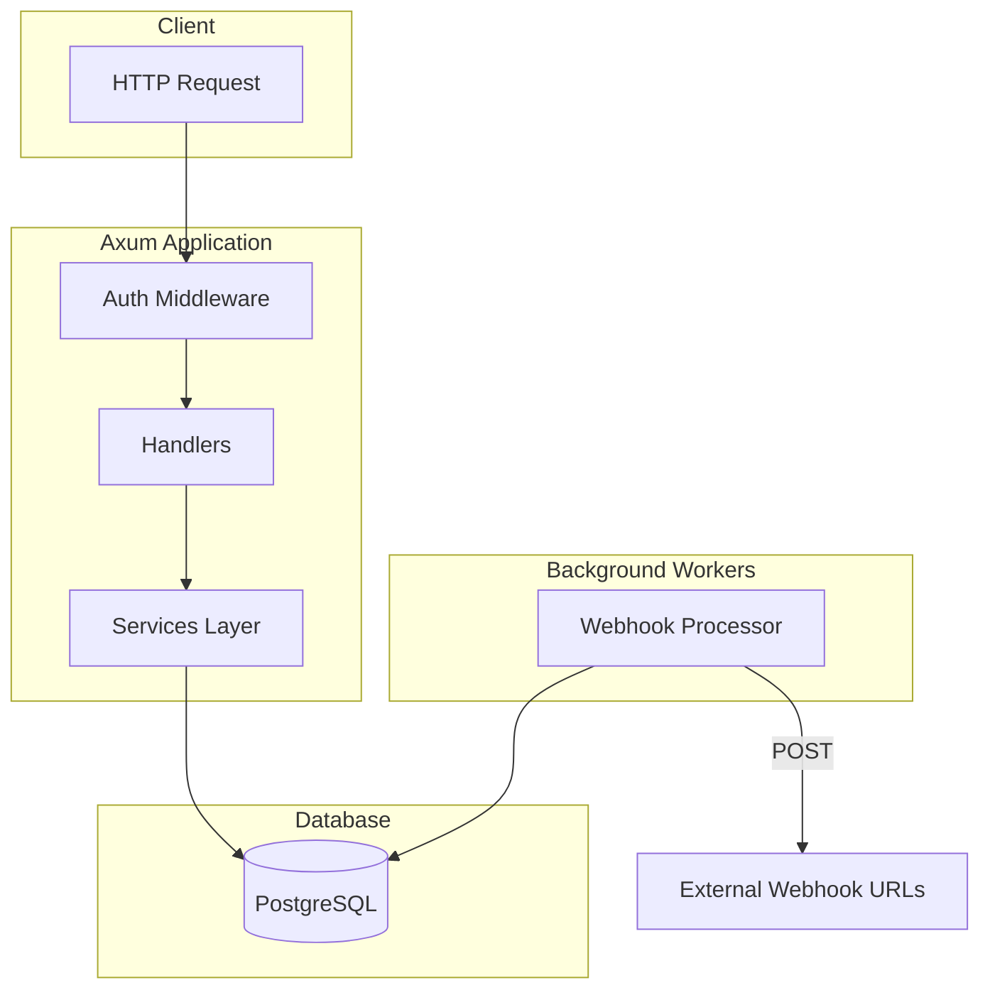
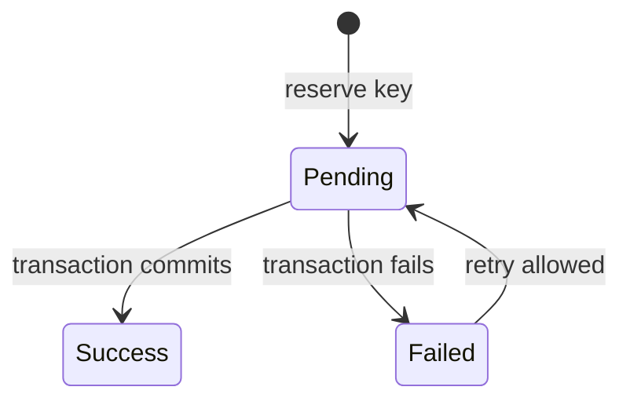
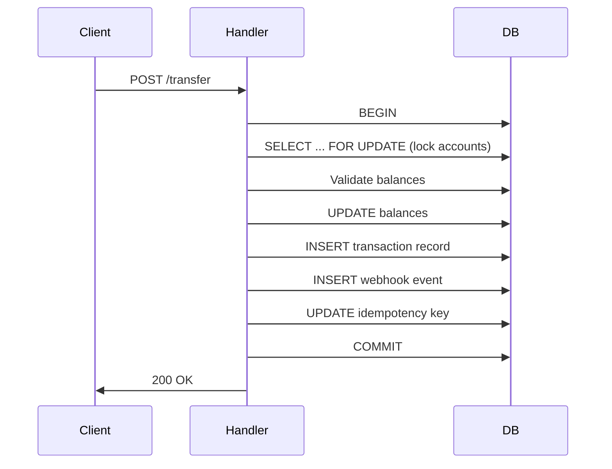
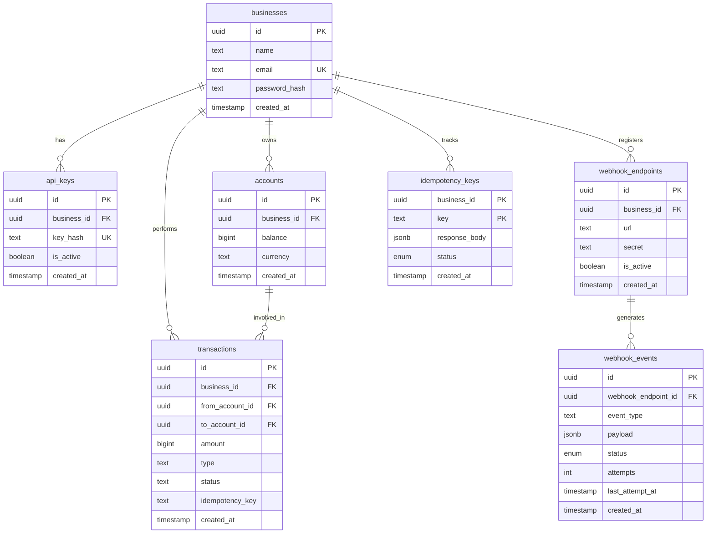
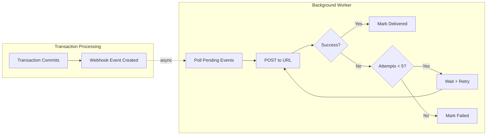

# Simple Transaction Service — Design Specification

## Overview

A RESTful transaction service built with **Rust/Axum** that enables businesses to manage accounts, execute monetary transactions (credits, debits, transfers), and receive webhook notifications. The service prioritizes correctness, atomicity, and idempotency.

---

## Architecture



### Layer Responsibilities

| Layer | Purpose |
|-------|---------|
| **Handlers** | HTTP layer, request/response serialization, thin orchestration |
| **Services** | Business logic, validation, database operations, idempotency |
| **Middlewares** | Cross-cutting concerns (authentication) |
| **Models** | Data transfer objects (DTOs) for API contracts |

---

## Key Design Decisions

### 1. Balance Representation

**Decision**: Store balances as `BIGINT` (cents/smallest currency unit)

**Rationale**: Floating-point arithmetic introduces precision errors in financial calculations. Storing values as integers in the smallest currency unit (e.g., cents for USD) eliminates rounding issues entirely. This is simpler and more reliable than using a decimal library.

```sql
balance BIGINT DEFAULT 0 NOT NULL  -- 10000 = $100.00
```

### 2. Idempotency Key Design

**Decision**: Idempotency keys are scoped per-business with a `(business_id, key)` composite primary key.

**Rationale**: 
- Allows businesses to use sequential keys (similar to blockchain nonces) for request ordering
- Different businesses can reuse the same key string without collision
- Enables clients to implement exactly-once semantics with simple counters



### 3. Transaction Atomicity

**Decision**: Use PostgreSQL transactions with `SELECT ... FOR UPDATE` row locking.

**Rationale**: Ensures balance updates are atomic and prevents race conditions. If a transfer fails at any point, the entire operation is rolled back.



### 4. Cross-Business Transfers

**Decision**: Source account must belong to the authenticated business; destination can be any account.

**Rationale**: 
- Prevents unauthorized debiting from other businesses' accounts
- Enables payment flows where a business sends funds to external accounts
- Destination ownership is not enforced since receiving funds is non-destructive

### 5. Currency Handling

**Decision**: Currencies must match for transfers; no automatic conversion.

**Rationale**: Currency conversion requires exchange rates, introduces complexity, and creates regulatory considerations. Enforcing same-currency transfers simplifies the system and avoids hidden conversion costs.

---

## Database Schema



### Key Indexes

| Table | Index | Purpose |
|-------|-------|---------|
| `api_keys` | `key_hash` | Fast API key lookup during authentication |
| `accounts` | `business_id` | Filter accounts by business |
| `transactions` | `(business_id, idempotency_key)` | Idempotency lookups |
| `webhook_events` | `status` | Efficient pending event polling |

---

## Webhook Design

### Delivery Model

Webhooks are delivered asynchronously via a background polling worker. Events are created within the same database transaction as the business operation, ensuring at-least-once delivery.



### Retry Strategy

- **Max attempts**: 5
- **Backoff**: Linear (`10 seconds × attempt_number`)
- **Concurrency control**: `FOR UPDATE SKIP LOCKED` prevents duplicate processing

### Event Types

| Event | Trigger |
|-------|---------|
| `transfer.created` | Successful transfer |
| `credit.created` | Successful credit |
| `debit.created` | Successful debit |

---

## Rate Limiting

### Strategy

The service implements per-API-key rate limiting using the **Token Bucket** algorithm (via `tower-governor`).

**Configuration**:
- **Quota**: 10 requests per second
- **Burst**: 20 requests
- **Key**: Extracted from the `Authorization` header
- **Backends**: In-memory (per instance)

**Behavior**:
- Requests exceeding the limit are rejected with `429 Too Many Requests`.
- Rate limiting is applied **after** authentication but **before** business logic.

---

## Operational Considerations

### Health Check

The `/` endpoint verifies database connectivity:
```json
{ "status": "healthy", "database": "connected" }
```

### Local Development

```bash
docker compose up
```

This starts:
- PostgreSQL 16 (port 5432)
- Rust application (port 3000)
- Python webhook consumer for testing (port 8000)

---

## Trade-offs & Limitations

| Decision | Trade-off |
|----------|-----------|
| **No currency conversion** | Simplicity over flexibility; users must manage same-currency accounts |
| **Polling-based webhooks** | Simpler than queue-based; adds latency (up to 2s between polls) |
| **Synchronous idempotency check** | One extra DB round-trip per request; ensures correctness |
| **Public accounts endpoint** | Enables account discovery; intentional for this use case |

---

## Future Improvements

- [ ] **OpenTelemetry**: Structured logging, distributed tracing, metrics
- [ ] **Webhook Signing**: HMAC-SHA256 signature instead of shared secret header
- [ ] **Pagination**: For list endpoints (`/accounts`, `/webhooks/list`)
